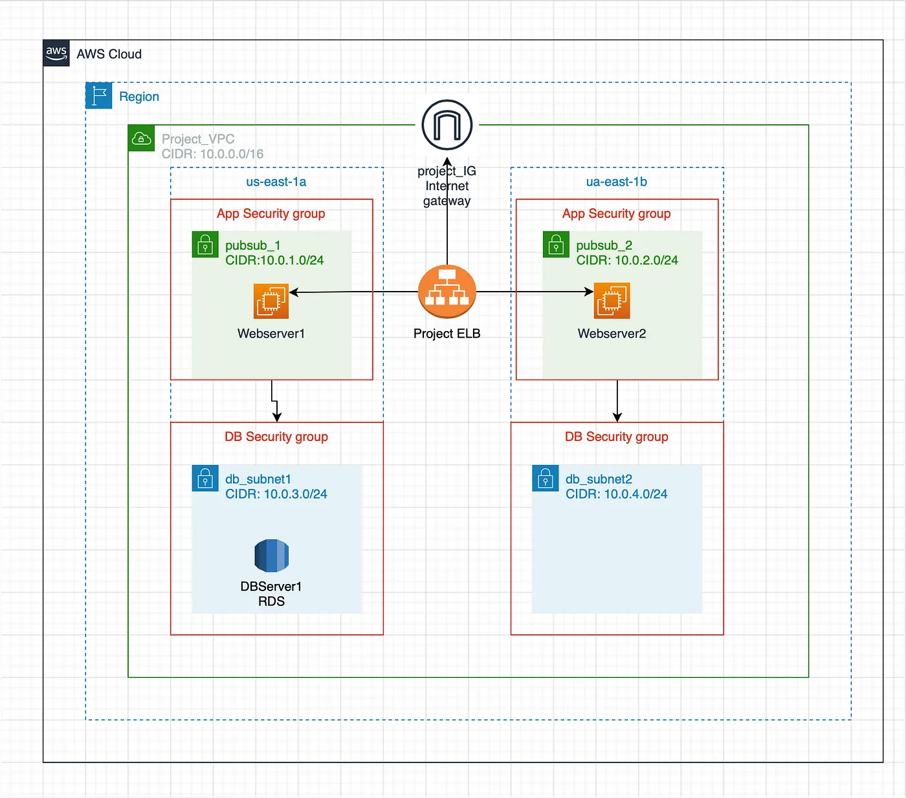

# Project2-Implementation-2-Tier-Architecture-in-AWS-using-Terraform
VPC + EC2 + ALB + IGW + SG + RDS and finally integrate with github actions to CI / CD

## Diagram for architecture of 2 - tire going to implement in this project
 

## This two-tier architecture will contain the following components: ##

- Deploy a VPC with CIDR 10.0.0.0/16
- Within the VPC we will have 2 public subnets with CIDR 10.0.1.0/24 and 10.0.2.0/24. Each public subnet will be in a different Availability Zone for high availability
- Create 2 private subnets with CIDR ‘10.0.3.0/24’ and ‘10.0.4.0/24’ and each will be in a different Availability Zone
- Deploy RDS MySQL instance.
- An Application load balancer that will direct traffic to the public subnets.
- Deploy one EC2 instance in each public subnet for high availability.
- Internet Gateway and Elastic IPs for EC2 instance.

## Prerequisites: ##
- Install AWS CLI
- AWS Account
- Code Editor (I have used VS Code for this deployment)

**Installation Guide**

**Step-1:** Verify AWS CLI is installed on your local machine by following command
```bash
$ aws --version
aws-cli/2.22.33 Python/3.12.6 Windows/11 exe/AMD64
```
If you see the Outout above then skip the step-1, Else follow the below steps.
## For Windows
1.  **Download the Installer:**
    - Go to the AWS CLI download page: AWS CLI Installer for Windows
    - Download the MSI installer for Windows.
2.  **Run the Installer:**
    - Locate the downloaded .msi file and double-click it.
    - Follow the on-screen instructions in the setup wizard.
3.  **Verify the Installation:**
    - Open a Command Prompt or PowerShell.
    - Run the command
    ```bash
    aws --version
    ```
    - You should see ouput similar to:
    ```bash
    aws-cli/2.x.x Python/x.x.x Windows/x.x
    ```
4.  **Add AWS CLI to Path (if necessary):**
    - If the aws command is not recognized, ensure the installation directory (usually C:\Program Files\Amazon\AWSCLI) is added to your system's PATH environment variable.

## For Linux
1.  **Download the AWS CLI Installer:**
    - Run the following command to download the AWS CLI installation script
    ```bash
    curl "https://awscli.amazonaws.com/awscli-exe-linux-x86_64.zip" -o "awscliv2.zip"
    ```
2.  **Unzip the Installer:**
    - Use unzip to extract the installer
    ```bash
    unzip awscliv2.zip
    ```
    - If unzip is not installed, install it using:
    ```bash
    sudo apt install unzip       # For Debian/Ubuntu
    sudo yum install unzip       # For CentOS/Red Hat
    ```
3.  **Run the Installer:**
    - Execute the installation script
    ```bash
    sudo ./aws/install
    ```
4.  **Verify the Installation:**
    - Run the following command to check if the AWS CLI is installed correctly
    ```bash
    aws --version
    ```
    - Output will look like:
    ```bash
    aws-cli/2.x.x Python/x.x.x Linux/x.x
    ```
5.  **Optional - Add to PATH:**
    - If the aws command isn't recognized, add /usr/local/bin to your PATH
    ```bash
    export PATH=$PATH:/usr/local/bin
    ```
    - You can add this line to your .bashrc or .zshrc file for persistence.

**Step-2:** Create Feature branch in gitbash terminal
1.  Open the gitbash terminal inside the project cloned directory
2.  Run the command:
    ```bash
    git checkout -b feature
    ```
**Step-3:** To get an access key in AWS, you can: 
1.  Sign in to the AWS Management Console
2.  Open the IAM console
3.  Select the user you want to create access keys for
4.  Select the Security credentials tab
5.  In the Access keys section, select Create access key
6.  Select Show to view the new access key pair
7.  Download the key file to your computer

**Step-4:** Post-Installation Steps:
1.  **Configure AWS CLI:**
    - Run
    ```bash
    aws configure
    ```
    - Provide your **Access Key ID, Secret Access Key**, Default Region, and preferred output format (e.g., json or table).